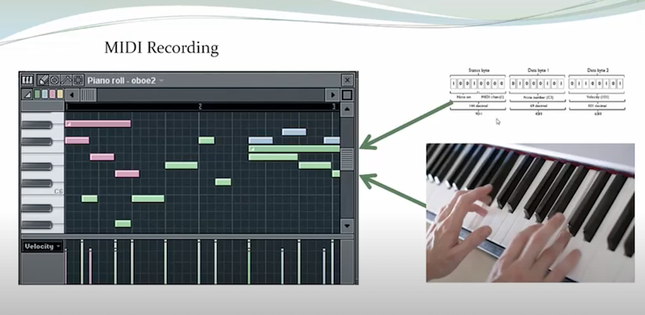
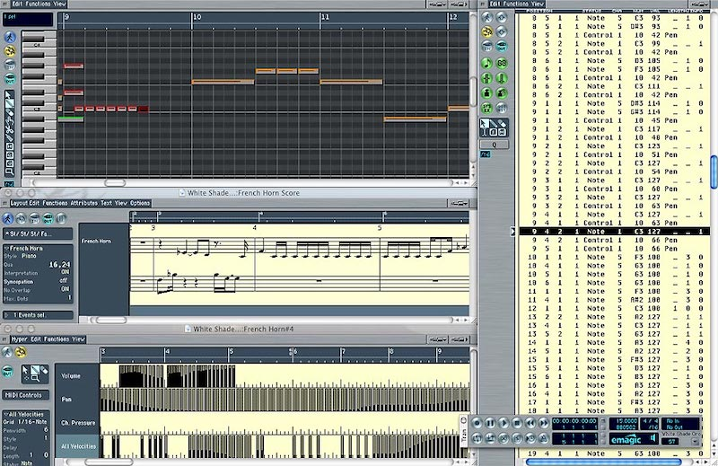
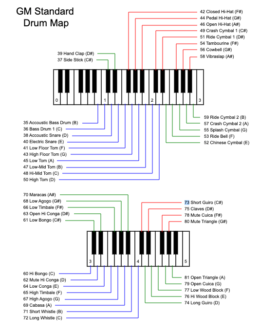
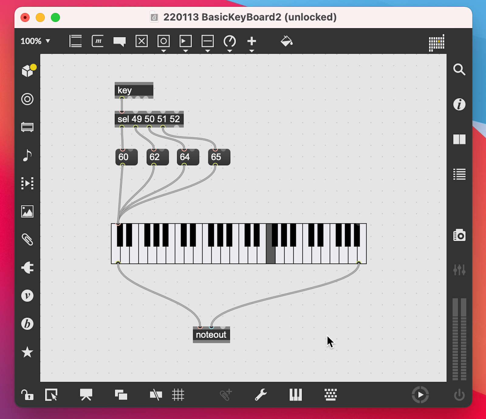

# About MIDI

### Overview

MIDI is a protocol for musical instruments and related devices to communicate. [This link](https://www.youtube.com/embed/sziykFl44CU) brings you to a short introductory video what you can do with it.

### The Protocol - How you use MIDI to make music
All information consist out of 7 bit numbers, so there are 128 different values between 0 and 127. 

The protocol allows to send the following information:

- Pitch - tone, Ex.: middle C (or C3) has the value 60
- Velocity - loud/low voice, volume
- Program - instrument
- Device identifier - if you have several MIDI devices

By sending messages with the above information to a MIDI instrument, you can play music.

### Programs (Instruments)
The diagram below shows pitch and program for values between 35 and 81. The keyboard is split in half as it would have been too long otherwise to display properly. As an example. 60 as pitch would play the middle C note, 60 as program plays Hi Bongo as an instrument. Program/instrument 0 is the default instrument and sounds like a grand piano.

### Musical Scales
Muscial compositions mostly stick to certain harmonies or change between them in a defined way to get a melody that expresses the composer's ideas and pleases our ears. Below you find two scales with different harmonies. They are using the same pitches, but as the starting pitch is different, they sound different.

#### C major scale
| Note	| C	| C#	| D	| D#	| E	| F	| F#	| G	| G#	| A	| A#	| B	| C |
|---      |---|---|---|---|---|---|---|---|---|---|---|---|---|
| MIDI pitch |	 60 |	61 |	62 |	63 |	64 | 	65 |	66 |	67 |	68 |	69 |	70| 	71 |	72 |
| C major	| X	|	| X	 | |	X |	X	| |	X	| |	X	| |	X	| X |

#### A minor scale
| Note	| A	| A#	| B	| C	| C#	| D	| D#	| E	| F	| F#	| G	| G#	| A |
|---      |---|---|---|---|---|---|---|---|---|---|---|---|---|
| MIDI pitch	| 69	| 70	| 71	| 72	| 73	| 74	| 75	| 76	| 77	| 78	| 79	| 80	| 81 |
| same pitches as C major |	x	| | x | x | |x||x|x||x||x|

You can use the below patch and add the missing 5 pitches to complete a scale. The keyboard will show you where to find the pitch played.

### Further Information
The Wikipedia entry [here](https://en.wikipedia.org/wiki/MIDI) has more materials about the MIDI protocol.
